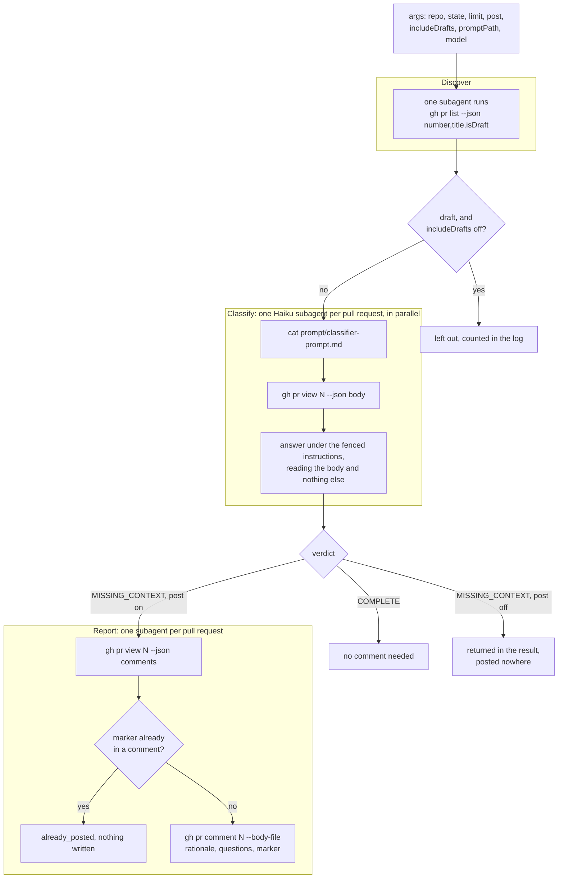

# pr-context-classifier

A CLI that reads a pull request body and reports whether the body gives a
reader complete context: what the PR is about and exactly what changed.
When context is missing, it writes author-facing clarifying questions.

The classifier runs on `openai/gpt-oss-20b` with bare routing through
OpenRouter. The current system prompt has no published measurement.
Appendix A gives its history.

## Install

Requires Node 22 or newer.

```bash
npm install -g .
```

The config file must exist at `~/.config/pr-context-classifier/config.json`.
It stores one field, `keyCommand`. The CLI runs it through bash and uses
stdout as the OpenRouter key. The key itself never appears in the config
file.

```json
{
  "keyCommand": "cat ~/.secrets/openrouter-key"
}
```

Put the key in the file the command reads, and restrict its permissions.

```bash
umask 077
printf '%s' "$OPENROUTER_API_KEY" > ~/.secrets/openrouter-key
```

## Usage

```bash
# classify a body file
pr-context-classifier body.md

# classify PR 42's body piped on stdin
pr-context-classifier -n 42 - < body.md

# custom question and model
pr-context-classifier -q "Does this explain the change?" -m openai/gpt-oss-20b body.md
```

Output is one JSON document on stdout.

```json
{
  "verdict": "MISSING_CONTEXT",
  "rationale": "the body lowers the cache TTL but never describes the stale data it fixes.",
  "clarifyingQuestions": [
    "What stale data did users see before the TTL change, and how was it noticed?"
  ],
  "model": "openai/gpt-oss-20b",
  "prNumber": "42",
  "question": "Does this pull-request body give a reader complete context to understand what the PR is about and exactly what changed, without reading code or the diff?",
  "latencyMs": 25935
}
```

`verdict` is `COMPLETE` or `MISSING_CONTEXT`. `clarifyingQuestions` is empty
for `COMPLETE`.

## Options

| Flag | Meaning |
| -- | -- |
| `-q <text>` | reader question (default: built-in question) |
| `-n <number>` | PR number, echoed in the output |
| `-m <slug>` | model id (default: `openai/gpt-oss-20b`) |
| `-c <path>` | config file path |
| `-t <seconds>` | give up on the OpenRouter request after this long (default: 120) |
| `-h` | help |
| `-` | read the body from stdin |

## Key resolution

1. If `OPENROUTER_API_KEY` is set, it wins.
2. Otherwise the CLI reads the config file, runs `keyCommand` through bash,
   and trims stdout for the key.

The config file is the only place that specifies the command. Credentials
stay in the file the command reads, so nothing in it is a credential.

## Classifying many pull requests at once

`.claude/workflows/pr-context-sweep.js` is a [Claude Code](https://claude.com/claude-code) workflow that classifies a whole repository's pull requests in parallel. One Haiku subagent per pull request reads `prompt/classifier-prompt.md` and answers under it. The workflow then comments on each body that misses context, quoting the rationale and the questions it produced.

The workflow calls no model API of its own, so it needs no OpenRouter key, no config file, and no build. It requires the `gh` CLI, authenticated for the repository you point it at.



The workflow pipelines the pull requests. A subagent starts the next phase for its own pull request the moment it finishes, so one subagent can post a comment while another still classifies a different body.

Copy the file into your own repository at `.claude/workflows/pr-context-sweep.js`, then ask Claude Code to run it:

```
Workflow({name: 'pr-context-sweep'})
```

That reports one verdict per open pull request and posts nothing. Add `post: true` once you have read the questions:

```
Workflow({name: 'pr-context-sweep', args: {post: true}})
```

### Arguments

| Key | Default | Meaning |
| -- | -- | -- |
| `repo` | the current repository | `owner/name` to classify |
| `state` | `open` | `open`, `closed`, `merged`, or `all` |
| `limit` | `100` | how many pull requests to list |
| `post` | `false` | comment on the pull requests that miss context |
| `includeDrafts` | `false` | include draft pull requests |
| `promptPath` | `prompt/classifier-prompt.md` | where the subagent reads the prompt |
| `model` | `haiku` | the subagent model |

Every comment ends with a `<!-- pr-context-classifier -->` marker, and each posting subagent reads the existing comments first. A second run skips a pull request it already commented on.

Running the workflow from another repository leaves the default `promptPath` unresolved. Pass the path to your checkout of this repository, or install the package and the subagent finds the prompt under `node_modules`.

## Tests

```bash
npm test
```

The tests cover config parsing, the bash key resolution, prompt loading,
response parsing, and argument parsing. They never call the network.

## Appendix A: prompt provenance

An Ori Eval run on 2026-09-17 compared four models (Kimi K3, GPT-OSS 20B,
DeepSeek V4 Flash, Ling Flash) on eleven real PR bodies, one labeled
`missing-context` and ten labeled `complete`. GPT-OSS 20B had the lowest
average latency and lowest cost, so the CLI defaults to it.

That run measured an earlier prompt. The earlier prompt had a special-case
block that encoded the answer to the eval's one `missing-context` case, so its
score did not show how the prompt handles other bodies (issue #2). The current
prompt in `prompt/classifier-prompt.md` replaces the block with general checks
that apply to every body, and no eval has scored it. Treat its verdicts as
unmeasured until an eval with more `missing-context` cases scores it.

Two further checks came from evidence about how bodies change. A scan of 50
recently merged pull requests read the edit history GitHub keeps for each
description, compared consecutive revisions, and dropped bot and banner edits.
41 of the 50 bodies carried a human edit: 69 edits, 322 added lines. Every
added line was then read, and two kinds of context the prompt never asked for
appeared in several unrelated pull requests.

- **Blast radius.** Bodies that fix a defect were edited to add how long it had
  been live, how widely it fired, or that it had never worked at all: a test
  that had failed for weeks with nothing running it, a field that recorded zero
  for every request since the route existed, a code path that never carried the
  value. The prompt asked for "the effect" of a change, and a body satisfies
  that by saying a bug is fixed without saying what it had been doing.
- **Negative scope.** Bodies were edited to add what the change deliberately
  left alone: a field that still ships and is still served, a value that stops
  arriving but stays stored, a behaviour that remains for the other path. A body
  listing only what moved leaves the reader unable to tell whether the
  neighbouring thing moved too.

Both patterns appear in at least four unrelated pull requests each under the
strictest reading, and in more under a looser one. The count is not quoted here
because it moves with the match and a figure a reader cannot reproduce is worse
than none.

The prompt carries both as checks now, each with a limit so it does not fire on
every body. A defect that never reached a shipping path has no duration, and a
change that only adds something has nothing to list. `tests/config.test.ts`
pins each check and each limit by phrase, so removing one fails the suite.
